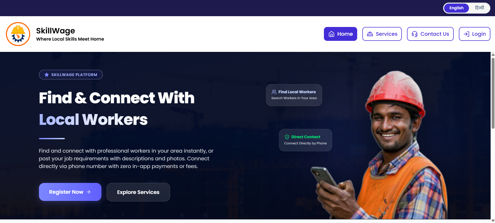

# [SkillWage — Connecting Customers with Skilled Tradespeople](https://skillwage.vercel.app/)

<p align="center">
  <a href="https://skillwage.vercel.app/" target="_blank">
    
  </a>
</p>

<p align="center">
  <strong>A full-stack web platform that bridges the gap between customers and skilled workers like electricians, plumbers, carpenters, painters, masons, and labourers.</strong>
</p>

<p align="center">
  <strong>Frontend Core</strong><br />
  
  
  
  
  
</p>

<p align="center">
  <strong>Frontend UI & Utilities</strong><br />
  
  
  
  
  
  
  
  
  
  
  
</p>

<p align="center">
  <strong>Backend & Database</strong><br />
  
  
  
  
  
  
  
</p>

---

## 📖 Table of Contents

- [About the Platform](#about-the-platform)
- [Key Features](#key-features)
- [Tech Stack](#tech-stack)
- [Project Architecture](#project-architecture)
- [Database Models](#database-models)
- [API Endpoints](#api-endpoints)
- [Setup Guide](#setup-guide)
- [Environment Variables](#environment-variables)
- [Admin Setup](#admin-setup)
- [Running the Project](#running-the-project)
- [Folder Structure](#folder-structure)

---

## About the Platform

**SkillWage** is a smart, web-based solution designed to connect **customers** seeking household and commercial services with **skilled tradespeople** in their locality. In many regions, finding trustworthy workers for everyday tasks — a leaking pipe, faulty wiring, or a fresh coat of paint — remains a challenge. SkillWage solves this by providing a transparent, location-aware marketplace where both sides benefit.

### Who is it for?

| Role        | Description |
|-------------|-------------|
| **Customer** | Homeowners, tenants, or business owners looking to hire skilled workers for specific tasks. They can browse workers by pincode, post job requirements, send service requests, rate workers, and manage their profile. |
| **Worker**   | Tradespeople (electricians, plumbers, carpenters, painters, masons, labourers) who register on the platform with their Aadhaar ID for verification. They can accept/reject incoming requests, set service charges, and build their reputation through ratings. |
| **Admin**    | Platform administrators who manage workers (verify/unverify, update details), manage customers, review support queries, and oversee service requests including manual OTP generation. |

---

## Key Features

### 🔐 Authentication & Authorization
- **Dual-role login system** — Customers and Workers register and log in separately with phone number + password.
- **Forgot Password Recovery** — Workers recover via Aadhaar & Date of Birth verification. Customers recover via an Email OTP verification process (valid for 10 minutes).
- **JWT-based session management** using secure HTTP-only cookies.
- **Email OTP verification** during registration to validate email ownership.
- **Admin panel** with separate authentication flow (admin accounts are created directly in MongoDB Atlas — no public registration).
- **Route protection** — Authenticated users cannot access auth pages; non-admin users cannot access the admin panel.

### 👷 Worker Management
- Workers register with full KYC: **name, phone, date of birth, gender, Aadhaar number, Aadhaar photo, profile photo, address (with pincode auto-lookup), occupation, and service charge**.
- **Occupation categories**: Labour, Electrician, Plumber, Mistri (Mason), Painter, Carpenter.
- **Verification system** — Admin can review Aadhaar images and mark workers as verified or unverified.
- **Status messages** — Admin can set a private status message visible only to the worker (e.g., "Please upload a clearer Aadhaar photo").
- **Average rating** calculated from customer feedback after completed jobs.

### 👤 Customer Experience
- Customers register with: **name, phone, email, password, address, pincode, and profile photo**.
- **Browse workers by pincode** — Customers see a feed of workers available in their area.
- **Post job requirements** — Customers can create posts with a description, category, and optional image. Workers in the same pincode can view these posts.
- **Service requests** — Send a hire request to a worker. Track the request lifecycle: `pending → accepted → completed` or `rejected`.
- **OTP-based job completion** — Once a worker accepts, the customer generates a 6-digit OTP. The worker enters the OTP to mark the job as complete, preventing fraudulent completions.
- **Rating system** — After job completion, customers rate the worker (1–5 stars). The worker's average rating is automatically recalculated.

### 📋 Service Request Lifecycle
```
Customer sends request → Worker receives it (Pending)
                         ↓
              Worker Accepts ──→ Customer generates OTP
                                         ↓
                              Worker enters OTP (Verified)
                                         ↓
                                  Job Completed ──→ Customer rates worker
                         ↓
              Worker Rejects ──→ Request closed
```

### 📝 Job Post Board
- Customers create posts describing the work they need done (e.g., "Need a plumber to fix kitchen sink").
- Posts are **location-based** — only workers in the same pincode area see them.
- Posts include a **category filter**, **description**, and optional **image attachment** (uploaded via Cloudinary).
- Workers can browse the post feed and reach out to customers.

### 🛠 Admin Panel (Desktop Only)
- **Support query management** — View, search, and resolve user support tickets. Admin can set resolution messages.
- **Worker management** — Full CRUD: search by name/Aadhaar/phone, view profile & Aadhaar images, verify/unverify workers, update any field, and set status messages.
- **Customer management** — Search and update customer details including address (with pincode auto-lookup).
- **Service request management** — View all requests with pagination, search by customer/worker phone, change request status via modal, and generate OTPs for accepted requests.

### 🌍 Internationalization (i18n)
- Full **English** and **Hindi** language support across the entire user-facing interface.
- Language detection from browser settings with manual toggle.
- Translation files organized by namespace: `common`, `home`, `auth`, `services`.

### 📍 Pincode-based Address Lookup
- During registration and in admin update modals, entering a 6-digit pincode automatically fetches **subdivision, city, and state** from the [India Postal Pincode API](http://www.postalpincode.in/Api-Details).

### 📸 Cloud-based Image Management
- Profile photos, Aadhaar images, post images, and support screenshots are uploaded to **Cloudinary** via signed upload.
- Images are served via Cloudinary CDN for fast global delivery.

### 🎨 Responsive Design
- Mobile-first design for the customer/worker app experience.
- Admin panel is **desktop-only** with a friendly prompt for mobile users.
- Bottom navigation bar on mobile, sidebar navigation on desktop.

---

## Tech Stack

### Frontend

| Technology | Purpose |
|---|---|
| **React 19** | UI library (latest with concurrent features) |
| **Vite 7** | Lightning-fast build tool and dev server |
| **TailwindCSS 4** | Utility-first CSS framework |
| **React Router 7** | Client-side routing and navigation |
| **TanStack React Query 5** | Server state management, caching, and data synchronization |
| **React Hook Form** | Performant form management with minimal re-renders |
| **Zod** | Schema-based form validation (shared approach with backend) |
| **Axios** | HTTP client with interceptors for auth handling |
| **i18next + react-i18next** | Internationalization (English + Hindi) |
| **Radix UI** | Accessible, unstyled primitives (Dialog, Select, Tabs, Label, Slot) |
| **Lucide React** | Beautiful, consistent icon library |
| **Sonner** | Elegant toast notification system |
| **Vaul** | Mobile-friendly drawer component |
| **class-variance-authority** | Component variant management |
| **clsx + tailwind-merge** | Conditional and conflict-free class merging |
| **tw-animate-css** | TailwindCSS animation utilities |

### Backend

| Technology | Purpose |
|---|---|
| **Node.js** | JavaScript runtime |
| **Express 5** | Web framework (latest version) |
| **Mongoose 8** | MongoDB ODM for schema modeling and queries |
| **JWT (jsonwebtoken)** | Stateless authentication via signed tokens |
| **bcryptjs** | Secure password hashing (12 salt rounds) |
| **Cloudinary SDK** | Server-side image upload management |
| **Nodemailer** | Email delivery for OTP verification during registration |
| **Zod** | Request body validation |
| **Helmet** | HTTP security headers |
| **CORS** | Cross-origin request configuration |
| **Morgan** | HTTP request logging (development) |
| **cookie-parser** | Parse and manage HTTP cookies |
| **express-rate-limit** | API rate limiting for abuse prevention |
| **dotenv** | Environment variable management |
| **Nodemon** | Auto-restart server during development |

### Database & Cloud Services

| Service | Purpose |
|---|---|
| **MongoDB** | NoSQL document database (local or Atlas) |
| **Cloudinary** | Cloud-based image storage and CDN delivery |
| **India Postal API** | Pincode → Address auto-lookup (external, free) |
| **Gmail SMTP** | Email OTP delivery via Nodemailer (App Passwords) |

---

## Project Architecture

```
SkillWage Full Project/
├── Backend/                    # Express.js REST API Server
│   ├── src/
│   │   ├── config/             # Database connection (MongoDB)
│   │   ├── controllers/        # Route handler logic (16 controllers)
│   │   ├── middlewares/        # Auth, error handling, validation (3 middleware files)
│   │   ├── models/             # Mongoose schemas (8 models)
│   │   ├── routes/             # Express route definitions (9 route files)
│   │   ├── utils/              # Cloudinary upload helpers (1 helper file)
│   │   ├── validators/         # Zod validation schemas (6 validators)
│   │   ├── app.js              # Express app setup (middleware, CORS, routes)
│   │   └── server.js           # Server bootstrap (connect DB, start listening)
│   ├── .env                    # Environment variables
│   └── package.json
│
└── Frontend/                   # React SPA (Vite)
    ├── src/
    │   ├── api/                # Axios API service functions (11 files)
    │   ├── assets/             # Static assets
    │   ├── components/         # Reusable UI components (8 files)
    │   │   ├── layouts/        # Page layouts (4 files)
    │   │   └── ui/             # Shadcn-style primitives (13 components)
    │   ├── hooks/              # React Query hooks (9 custom hooks)
    │   ├── lib/                # Router config, i18n setup, Zod schemas, utils (4 files/directories)
    │   ├── locales/            # Translation files (en/, hi/)
    │   └── page/               # Page components (22 pages total)
    │       ├── admin/          # Admin panel pages (6 pages)
    │       ├── app/            # Authenticated app pages (10 pages)
    │       └── auth/           # Login, Registration & Forgot Password (3 pages)
    ├── .env                    # Frontend environment variables
    ├── index.html              # Entry HTML
    ├── vite.config.js          # Vite configuration
    └── package.json
```

---

## Database Models

### Customer
| Field | Type | Description |
|---|---|---|
| fullName | String | Customer's full name |
| phoneNumber | String | Unique phone number (indexed) |
| email | String | Unique email address (indexed) |
| password | String | Hashed password (bcrypt, 12 rounds) |
| address | String | Street address |
| pincode | String | Postal pincode |
| subdivision | String | Auto-filled from pincode API |
| city | String | Auto-filled from pincode API |
| state | String | Auto-filled from pincode API |
| profileImage | String | Cloudinary image URL |

### Worker
| Field | Type | Description |
|---|---|---|
| fullName | String | Worker's full name |
| phoneNumber | String | Unique phone number (indexed) |
| dateOfBirth | Date | Date of birth |
| gender | Enum | `male`, `female`, `other` |
| aadhaarNumber | String | Unique Aadhaar ID (for KYC) |
| password | String | Hashed password |
| address, pincode, subdivision, city, state | String | Location fields |
| serviceCharge | Number | Per-job charge set by worker |
| profileImage | String | Cloudinary profile photo URL |
| aadhaarImage | String | Cloudinary Aadhaar card image URL |
| occupation | Enum | `labour`, `electrician`, `plumber`, `mistri`, `painter`, `carpenter` |
| averageRating | Number | Calculated average from customer ratings |
| isVerified | Boolean | Admin verification status |
| statusMessage | String | Private admin message (visible only to worker) |

### ServiceRequest
| Field | Type | Description |
|---|---|---|
| customer | ObjectId → Customer | The customer who initiated the request |
| worker | ObjectId → Worker | The worker being hired |
| status | Enum | `pending`, `accepted`, `completed`, `rejected` |
| serviceType | String | Auto-filled from worker's occupation |
| otp | String | 6-digit OTP for job completion verification |
| otpExpiresAt | Date | OTP expiration (10 minutes) |
| rating | Number | 1–5 star rating (set after completion) |
| hasRated | Boolean | Whether the customer has submitted a rating |

### Post
| Field | Type | Description |
|---|---|---|
| customer | ObjectId → Customer | The customer who created the post |
| pincode | String | Location-based matching (indexed) |
| category | Enum | Same as worker occupations |
| description | String | Job description |
| status | Enum | `pending`, `completed` |
| postImage | String | Optional Cloudinary image |

### Support
| Field | Type | Description |
|---|---|---|
| user | ObjectId → Customer/Worker | Polymorphic reference |
| userModel | Enum | `Customer` or `Worker` |
| userName, userRole, userNumber | String | Denormalized user info |
| query | String | Support ticket message |
| screenshot | String | Optional Cloudinary screenshot |
| status | Enum | `pending`, `resolved` |
| statusMessage | String | Admin response message |

### Admin
| Field | Type | Description |
|---|---|---|
| name | String | Admin name |
| email | String | Unique email |
| password | String | Plain text or hashed (supports both for Atlas-created accounts) |

### Contact
| Field | Type | Description |
|---|---|---|
| fullname | String | Sender's name |
| email | String | Sender's email |
| message | String | Contact form message |
| isRead | Boolean | Read status |

### Otp
| Field | Type | Description |
|---|---|---|
| email | String | Email address (indexed) |
| otp | String | 6-digit OTP for password reset |
| expiresAt | Date | TTL index for automatic deletion after 10 minutes |

---

## API Endpoints

### Authentication (`/api/auth`)
| Method | Endpoint | Description |
|---|---|---|
| POST | `/worker/register` | Register worker |
| POST | `/customer/register` | Register customer |
| POST | `/worker/login` | Login worker |
| POST | `/customer/login` | Login customer |
| POST | `/logout` | Clear auth cookie and logout |
| GET | `/me` | Get current authenticated user profile |
| POST | `/worker/forgot-password` | Worker forgot password (verify DOB/Aadhaar) |
| POST | `/customer/forgot-password/send-otp` | Customer forgot password (send email OTP) |
| POST | `/customer/forgot-password/reset` | Customer forgot password (verify OTP & reset) |

### Workers (`/api/workers`)
| Method | Endpoint | Description |
|---|---|---|
| GET | `/` | Get workers filtered by pincode |

### Service Requests (`/api/requests`)
| Method | Endpoint | Description |
|---|---|---|
| GET | `/` | Get user's requests (paginated) |
| POST | `/` | Create a new service request |
| PATCH | `/:id/accept` | Worker accepts a request |
| PATCH | `/:id/reject` | Worker rejects a request |
| POST | `/:id/generate-otp` | Customer generates completion OTP |
| POST | `/:id/verify-otp` | Worker verifies OTP to complete job |
| POST | `/:id/rate` | Customer rates the worker |

### Posts (`/api/post`)
| Method | Endpoint | Description |
|---|---|---|
| GET | `/` | Get posts by pincode (paginated) |
| POST | `/` | Create a new post |
| PUT | `/:id` | Update post |
| DELETE | `/:id` | Delete post |

### Profile (`/api/profile`)
| Method | Endpoint | Description |
|---|---|---|
| PUT | `/personal` | Update personal details |
| PUT | `/address` | Update address |
| PUT | `/password` | Change password |
| PUT | `/service-charge` | Update worker service charge |

### Support (`/api/support`)
| Method | Endpoint | Description |
|---|---|---|
| GET | `/` | Get user's support tickets |
| POST | `/` | Create a support ticket |

### Contact (`/api/contact`)
| Method | Endpoint | Description |
|---|---|---|
| POST | `/` | Submit a contact form message |

### Cloudinary (`/api/cloudinary`)
| Method | Endpoint | Description |
|---|---|---|
| GET | `/signature` | Get signed upload params for Cloudinary |

### Admin (`/api/admin`)
| Method | Endpoint | Description |
|---|---|---|
| POST | `/auth/login` | Admin login |
| POST | `/auth/logout` | Admin logout |
| GET | `/auth/me` | Get current admin |
| GET | `/support` | List all support queries (paginated, searchable) |
| PUT | `/support/:id` | Update support ticket status & message |
| GET | `/workers` | List all workers (paginated, searchable, filterable) |
| PUT | `/workers/:id` | Update worker details |
| GET | `/customers` | List all customers (paginated, searchable) |
| PUT | `/customers/:id` | Update customer details |
| GET | `/requests` | List all service requests (paginated, searchable) |
| PUT | `/requests/:id/status` | Update request status |
| PUT | `/requests/:id/otp` | Generate OTP for an accepted request |
| GET | `/contacts` | List all contact messages (paginated) |
| DELETE | `/contacts/:id` | Delete a contact message |

---

## Setup Guide

### Prerequisites

Make sure you have the following installed:

- **Node.js** (v18 or higher recommended)
- **npm** (comes with Node.js)
- **MongoDB** (local installation or [MongoDB Atlas](https://cloud.mongodb.com) cloud account)
- **Cloudinary** account (free tier: [cloudinary.com](https://cloudinary.com))
- **Gmail account** with [App Password](https://myaccount.google.com/apppasswords) enabled for email OTP

### Step 1: Clone the Repository

```bash
git clone https://github.com/imsunilbaghel/SkillWage
cd "SkillWage Full Project"
```

### Step 2: Install Dependencies

```bash
# Install backend dependencies
cd Backend
npm install

# Install frontend dependencies
cd ../Frontend
npm install
```

### Step 3: Configure Environment Variables

Create the `.env` files in both `Backend/` and `Frontend/` directories. See the [Environment Variables](#environment-variables) section below for all required keys.

### Step 4: Set Up MongoDB

**Option A — Local MongoDB:**
1. Install MongoDB Community Edition.
2. Start the MongoDB service.
3. Set `MONGODB_URI=mongodb://localhost:27017/skillwage` in `Backend/.env`.

**Option B — MongoDB Atlas (Cloud):**
1. Create a free cluster at [cloud.mongodb.com](https://cloud.mongodb.com).
2. Create a database user and whitelist your IP.
3. Get the connection string and set it as `MONGODB_URI` in `Backend/.env`.
   ```
   MONGODB_URI=mongodb+srv://<username>:<password>@<cluster>.mongodb.net/skillwage
   ```

### Step 5: Set Up Cloudinary

1. Sign up at [cloudinary.com](https://cloudinary.com).
2. Go to **Dashboard** → copy your **Cloud Name**, **API Key**, and **API Secret**.
3. Add them to both `Backend/.env` and `Frontend/.env`.

### Step 6: Set Up Email (Gmail SMTP)

1. Go to [Google Account → App Passwords](https://myaccount.google.com/apppasswords).
2. Generate an App Password for "Mail".
3. Set `EMAIL_USER` to your Gmail address and `EMAIL_PASS` to the generated App Password in `Backend/.env`.

> **Note:** You must have 2-Factor Authentication enabled on your Google account to generate App Passwords.

---

## Environment Variables

### Backend (`Backend/.env`)

```env
# Server Config
PORT=8080
NODE_ENV=development

# MongoDB
MONGODB_URI=mongodb://localhost:27017/skillwage    # or your Atlas connection string

# JWT
JWT_SECRET=your_strong_secret_key_here             # Use a long, random string
JWT_EXPIRES_IN=7d                                   # Token expiry duration

# Cookie
COOKIE_MAX_AGE=604800000                            # 7 days in milliseconds

# CORS
CORS_ORIGIN=http://localhost:5173                   # Frontend URL

# Cloudinary
CLOUDINARY_CLOUD_NAME=your_cloud_name
CLOUDINARY_API_KEY=your_api_key
CLOUDINARY_API_SECRET=your_api_secret

# Email (Gmail SMTP)
EMAIL_USER=your_email@gmail.com
EMAIL_PASS=your_app_password                        # Gmail App Password (16 chars)
```

### Frontend (`Frontend/.env`)

```env
VITE_API_URL=http://localhost:8080/api
VITE_CLOUDINARY_CLOUD_NAME=your_cloud_name
VITE_CLOUDINARY_API_KEY=your_api_key
```

> ⚠️ **Security Note:** Never commit `.env` files to version control. Both directories include `.gitignore` rules to exclude them.

---

## Admin Setup

Admin accounts are **not** created through the application UI. They are manually created directly in MongoDB.

### Using MongoDB Atlas:

1. Go to your Atlas cluster → **Browse Collections** → `skillwage` database → `admins` collection.
2. **Insert a document** with the following structure:
   ```json
   {
     "name": "Admin Name",
     "email": "admin@example.com",
     "password": "your_plain_text_password"
   }
   ```
3. The system supports both **plain text** and **bcrypt-hashed** passwords for admin accounts. If the password doesn't start with `$2` (bcrypt prefix), it is compared as plain text.

### Using MongoDB Shell (local):

```bash
mongosh
use skillwage
db.admins.insertOne({
  name: "Admin",
  email: "admin@example.com",
  password: "your_secure_password"
})
```

After creating the admin, navigate to `/admin/login` in your browser.

---

## Running the Project

### Development Mode

Open **two terminal windows**:

**Terminal 1 — Backend:**
```bash
cd Backend
npm run dev
```
The API server starts at `http://localhost:8080`. You should see:
```
SkillWage Server is running on port 8080
MongoDB Connected | Host: ... | DB: skillwage
```

**Terminal 2 — Frontend:**
```bash
cd Frontend
npm run dev
```
The Vite dev server starts at `http://localhost:5173`.

### Production Build

```bash
cd Frontend
npm run build
```

The optimized static files are output to `Frontend/dist/`.

For the backend in production:
```bash
cd Backend
npm start
```

---

## Folder Structure

### Backend — Controllers (16 files)

| Controller | Responsibility |
|---|---|
| `authController.js` | Login, logout, registration, email OTP, current user |
| `forgotPasswordController.js` | Password recovery for Workers (via Aadhaar/DOB check) and Customers (via email OTP check) |
| `registerController.js` | Customer & Worker registration with email verification |
| `profileController.js` | Personal details, address, password, service charge updates |
| `workerController.js` | Worker listing by pincode for customers |
| `requestController.js` | Full service request lifecycle (CRUD, accept, reject, OTP, rate) |
| `postController.js` | Job post CRUD (create, read, update, delete) |
| `supportController.js` | User-facing support ticket creation and listing |
| `contactController.js` | Public contact form submission |
| `cloudinaryController.js` | Signed Cloudinary upload parameter generation |
| `adminAuthController.js` | Admin login, logout, session |
| `adminWorkerController.js` | Admin worker management (list, update, verify) |
| `adminCustomerController.js` | Admin customer management (list, update) |
| `adminSupportController.js` | Admin support query management |
| `adminRequestController.js` | Admin service request management (status, OTP) |
| `adminContactController.js` | Admin contact message management (list, delete) |

### Backend — Middleware (3 files)

| Middleware | Purpose |
|---|---|
| `auth.js` | JWT verification (`verifyAuth`), role checks (`isAdmin`, `isWorker`, `isCustomer`) |
| `errorHandler.js` | Global error handler with environment-aware stack traces |
| `validate.js` | Zod schema validation middleware |

### Frontend — Custom Hooks (9 files)

| Hook | Purpose |
|---|---|
| `useAuth.js` | Authentication state (login, register, current user) |
| `useAdmin.js` | All admin panel operations (workers, customers, support, requests) |
| `useRequests.js` | Service request operations (CRUD, accept, reject, OTP, rate) |
| `usePosts.js` | Job post operations (CRUD, infinite scroll) |
| `useProfile.js` | Profile update mutations |
| `useSupport.js` | Support ticket operations |
| `useWorkers.js` | Worker listing queries |
| `useContact.js` | Contact form submission |
| `useLocation.js` | Pincode → address auto-lookup |

### Frontend — Page Components (22 pages total)

| Page | Route | Description |
|---|---|---|
| `HomePage.jsx` | `/` | Landing page with platform introduction |
| `Service.jsx` | `/service` | Service categories showcase |
| `Contactus.jsx` | `/contactus` | Public contact form |
| `Login.jsx` | `/auth/login` | Dual-role login (Customer/Worker tabs) |
| `RegistrationPage.jsx` | `/auth/register` | Dual-role registration with email OTP |
| `ForgotPassword.jsx` | `/auth/forgot-password` | Dual-role forgot password (OTP for Customer, Aadhaar/DOB for Worker) |
| `AppHome.jsx` | `/app` | Authenticated dashboard (role-based) |
| `CustomerHome.jsx` | `/app` (customer) | Worker browsing by pincode |
| `PostPage.jsx` | `/app/post` | Job post feed and creation |
| `Requests.jsx` | `/app/requests` | Service request timeline |
| `ProfileMenu.jsx` | `/app/profile` | Profile settings hub |
| `Personal.jsx` | `/app/profile/personal` | Edit personal details |
| `Address.jsx` | `/app/profile/address` | Edit address with pincode lookup |
| `ServiceCharge.jsx` | `/app/profile/service-charge` | Workers set their charge |
| `Password.jsx` | `/app/profile/password` | Change password |
| `SupportPage.jsx` | `/app/profile/support` | Support ticket management |
| `AdminLogin.jsx` | `/admin/login` | Admin login page |
| `AdminSupport.jsx` | `/admin` | Admin support query dashboard |
| `AdminWorkers.jsx` | `/admin/workers` | Admin worker management |
| `AdminCustomers.jsx` | `/admin/customers` | Admin customer management |
| `AdminRequests.jsx` | `/admin/requests` | Admin service request management |
| `AdminContacts.jsx` | `/admin/contacts` | Admin contact message management |

---

<p align="center">
  Built with ❤️ by the SkillWage Team
</p>
